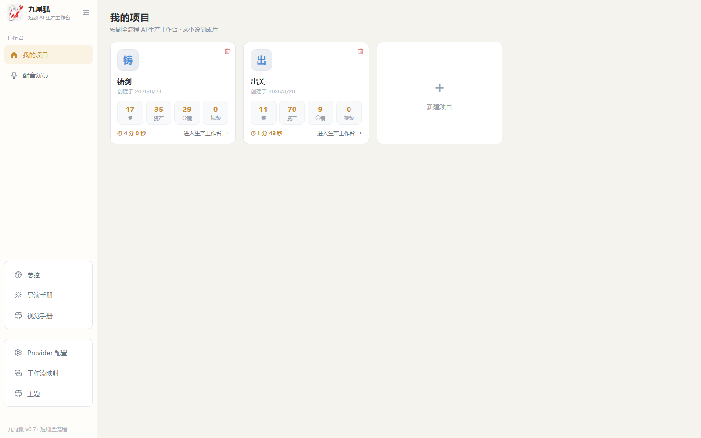
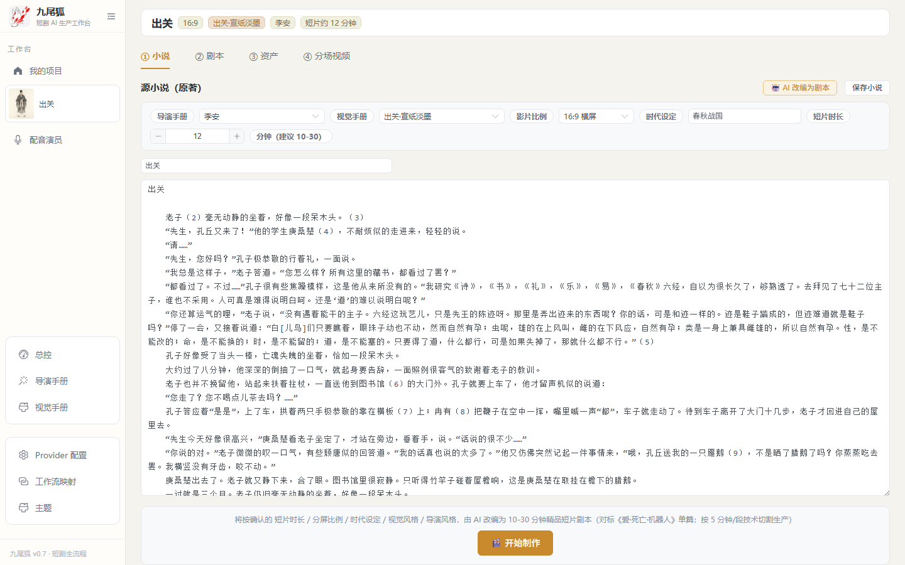
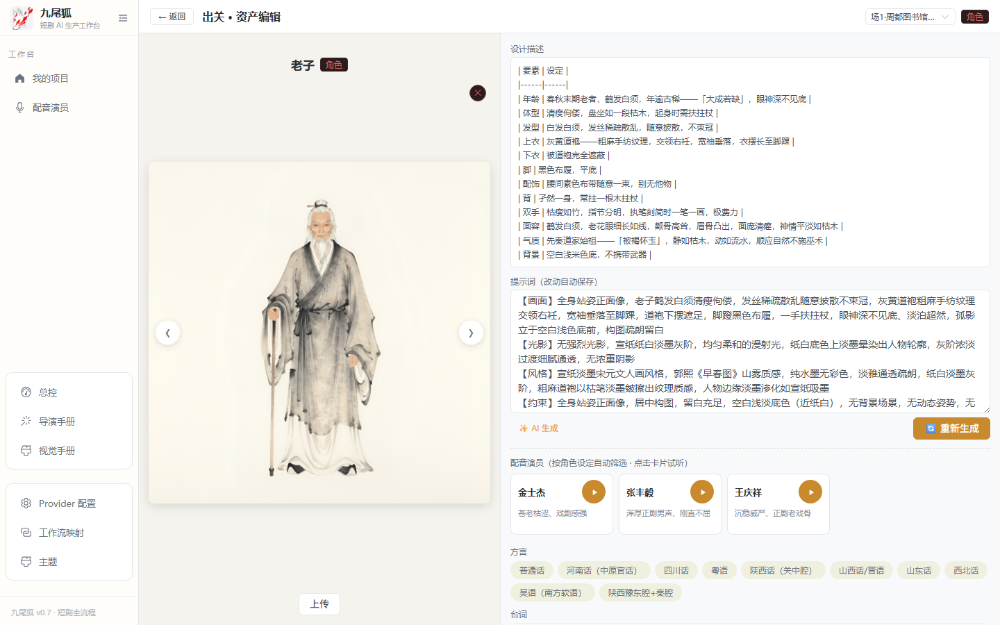
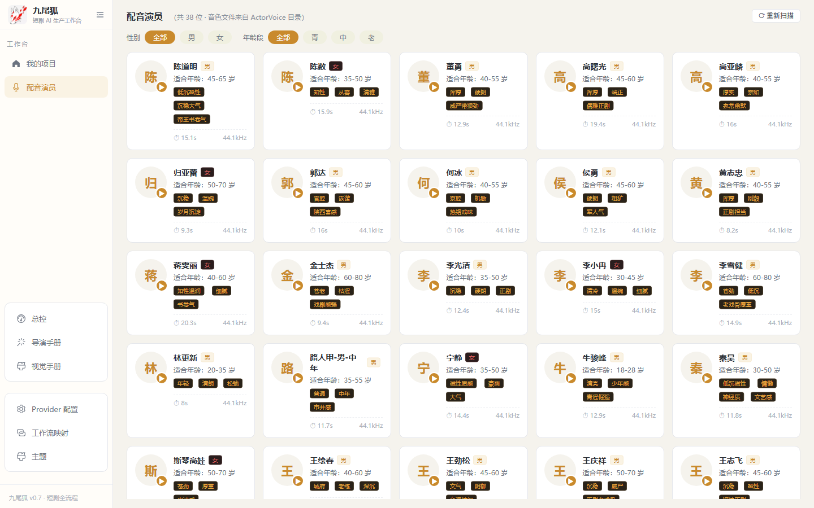

# 🦊 九尾狐 · nine_tailed_fox

> **鲁迅《故事新编》精品短片全流程一站式 AI 生产工作台**
> 单篇 10–30 分钟、对标《爱·死亡·机器人》的短片生产线 —— 8 篇、8 种美术风格、一人可完成的完整制作链路。

[《铸剑》制作中] · 特化为《故事新编》8 篇项目支持（不做其他短剧）

---

## 项目定位

九尾狐是一个 **Web + AI 混合架构**的短片生产工作台，把一部短片从「剧本创意」到「音视频素材产出」的全链路集成到一个界面里，通过 AI 深度辅助 + 本地生成（ComfyUI）让单人或小团队也能完成精品短片生产。

**流程范围**：`选题灵感 → 剧本创作 → 分镜可视化 → 音视频生成 → 素材入库`

**设计特点**：

- 🎬 **8 篇 8 种视觉手册**：铸剑（蒋兆和写实水墨）／奔月（汉画像石）／理水（白描枯山水）／补天（敦煌重彩）／采薇（枯山水淡彩）／非攻（水墨草书版刻）／出关（宣纸淡墨）／起死（皮影戏台）
- 🎥 **导演手册驱动**：12 位导演（侯孝贤、徐克、张彻…）风格 DNA 注入拆镜与视频提示词
- 🎨 **静态资产生成**：角色（纯白底三视图风格）/ 场景 / 道具，风格根三重过滤 + 视觉手册约束
- 🎞️ **r2v 多图参考视频**：MiniMax H3 导演台按场串联，角色/场景/道具参考图锁定一致性，不依赖首帧
- 🎙️ **方言配音**：《故事新编》8 篇各配方言（河南话/陕西话/晋语/西北话…）+ 演员音色库 + SoulX 合成试听
- 📚 **技能文件化**：Agent 核心提示词外化为 Markdown 技能（视觉/导演/演出），设置中心在线编辑即生效

## 界面截图

| 项目管理 | 项目工作台（剧本/手册/拆镜） |
|:---:|:---:|
|  |  |

| 资产编辑（角色设定/提示词/配音） | 配音演员库 |
|:---:|:---:|
|  |  |

## 技术栈

| 层 | 技术 |
|----|------|
| Web 前端 | Vue 3 + Vite + Element Plus + Vue Flow（无限画布） |
| Server | Express 5 + Prisma + SQLite |
| AI 服务 | FastAPI + LangChain（剧本拆镜 / 提示词 / H3 视频提示词） |
| 图像生成 | ComfyUI（Z-image / Qwen / Klein 工作流，本地或云端） |
| 视频生成 | MiniMax H3 Director（r2v 多图参考，分段导出 + ffmpeg 拼接） |
| 配音 | ActorVoice 素材库 + SoulX / Qwen3TTS 方言合成 |

## 快速开始

> ⚠️ 仓库不包含密钥 / 运行数据（.env、数据库、生成的 oss 素材均已 gitignore，需自行配置）。

### 依赖

- Node.js 18+ / pnpm
- Python 3.11+（AI 服务，LangChain 环境）
- ComfyUI（可选：图像/视频本地生成需自行部署并配置工作流）

### 安装

```bash
pnpm install
# 配置环境变量
cp apps/server/.env.example apps/server/.env   # 自行填写 DEEPSEEK_API_KEY 等
```

### 运行

```bash
# 1. 初始化数据库
pnpm db:push

# 2. 启动 server + web
pnpm dev            # server: http://localhost:3000  web: http://localhost:5173

# 3. 启动 AI 服务（独立终端，注意清代理）
cd apps/ai
python -m uvicorn main:app --port 8001 --host 127.0.0.1
```

浏览器打开 http://localhost:5173

## 项目结构

```
nine_tailed_fox/
├── apps/
│   ├── web/          # Vue 3 前端（项目工作台/资产编辑/分场视频/配音）
│   ├── server/       # Express + Prisma（资产/分镜/视频/设置/素材库 API）
│   └── ai/           # FastAPI + LangChain（拆镜/提示词/手册生成）
├── Doc/              # 设计文档（架构/PRD/路线图）
├── docs/screenshots/ # README 截图
└── art_skills/       # 8 篇视觉手册（Markdown 技能文件）
```

## 设计文档

- [00-Overview](Doc/00-Overview.md) — 项目总览与《故事新编》路线图
- [02-Architecture](Doc/02-Architecture.md) — 系统架构
- [08-Workbench-Canvas-Design](Doc/08-Workbench-Canvas-Design.md) — 无限画布设计
- [10-Story-New-Compilation-Roadmap](Doc/10-Story-New-Compilation-Roadmap.md) — 8 篇短片化路线图

## 说明

- 本项目为个人创作生产工具，界面/素材版权归各原作品与作者所有
- 生成内容仅供学习研究，请遵守相关法律法规与平台条款
